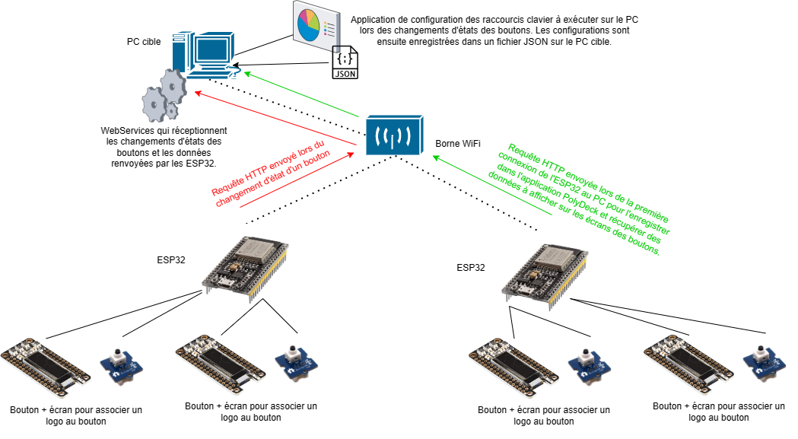
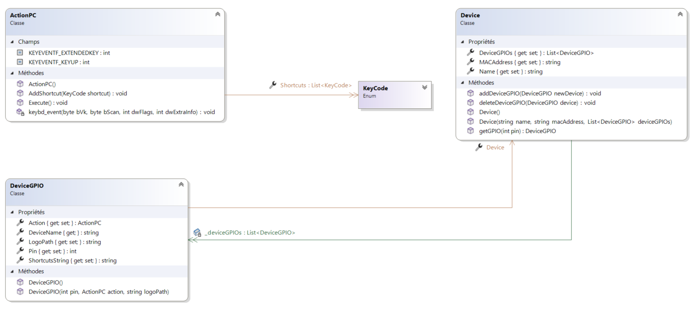
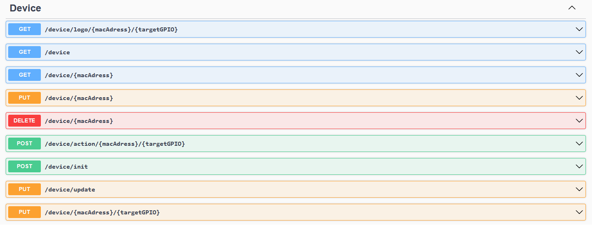
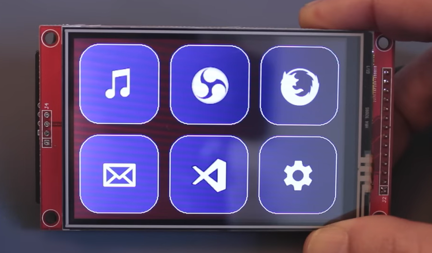
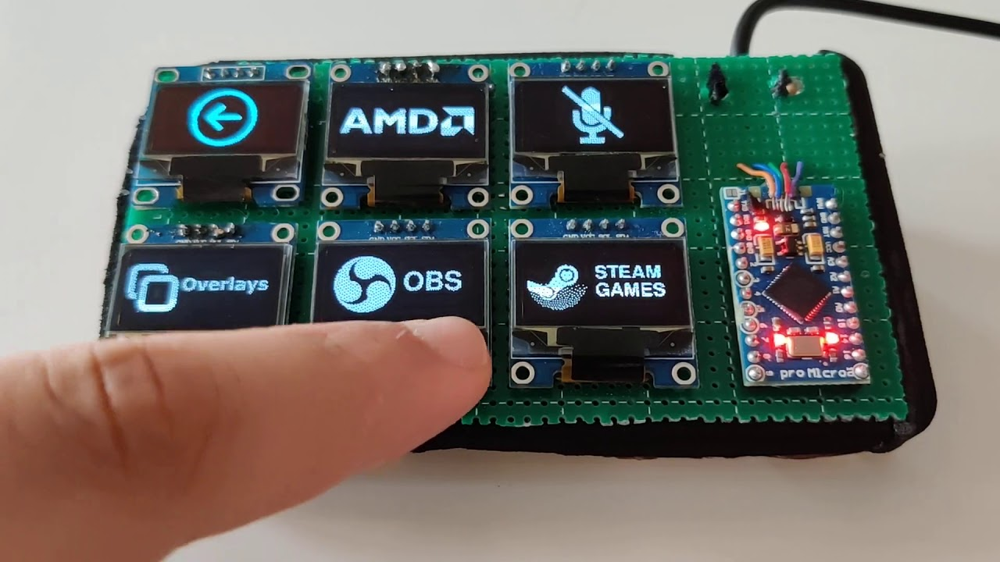

# IOT Yanis Quentin - PolyStream Deck

## Introduction

Dans le cadre de ce projet IOT, nous avons décidé de réaliser un Stream Deck.

Vidéo de présentation : https://youtu.be/pWZ-P_m0hJU

## Qu’est-ce qu’un Stream Deck ?

Un stream deck est en général un objet connecté localement à un ordinateur, permettant la configuration et la personnalisation de boutons, pouvant être tactiles, avec un écran ou non. 

Chaque bouton est lié à un raccourcis défini par l’utilisateur et peut par exemple : 
- Lancer une application
- Jouer un son prédéfini
- Activer une fonctionnalité de l’ordinateur
- etc

Le “Stream Deck” porte ce nom parce qu’il est initialement destiné aux "Streamers" communauté de personnes partageant leur parties de jeux vidéo, des discussions, leurs activités et autres en ligne et en direct sur internet.
Les plateformes les plus importantes de stream sont [Twitch](www.twitch.tv) et [YouTube](www.youtube.com).

Afin de pouvoir diffuser sur ces plateformes il faut réunir 2 conditions : 
- Posséder un compte la plateforme
- Diffuser son activité à l’aide d’une application tierce comme par exemple OBS la plus connue et plus utilisée des applications de streaming

### Exemples de Stream Deck les plus connus

https://www.elgato.com/fr/stream-deck 

## Polystream Deck

### Idée de notre projet

Notre projet consisterait en la création d’un Stream Deck open source avec une documentation détaillant son installation par n’importe qui.

Il faudrait également pouvoir connecter autant de boutons que l’on veut afin qu’ils soient automatiquement reconnus.

### Matériel

#### Matériel Final

- Esp32
- Ecran Adafruit SH110X
- Bouton poussoir

#### Matériel idéal

- [ ] Carte programmable (Pas de préférence, la plus petite possible)
- [ ] Boutons interactifs
  - [ ] Boutons LCD / Tactiles
    - [ ] [Ref 1](https://www.adafruit.com/product/1770)
    - [ ] [Ref 2](https://www.adafruit.com/product/3533)
    - [ ] [Ref 3](https://www.adafruit.com/product/5423)
  - [ ] Ecran tactile complet
    - [ ] [Ref 1]()
    - [ ] [Ref 2]()
  - [ ] Potentiomètres
    - Gestion du volume ou autre options nécessitant ce genre de controleur
  - [ ] etc

## Application

### Besoin

Permettre à un utilisateur de créer les raccourcis qu’il souhaite sur son ordinateur en les liant aux boutons de notre Stream Deck.

### Fonctionnalités
Le Stream Deck que nous avons conçu permet d'exécuter des raccourcis clavier sur le PC cible sur lequel l’application PolyDeck est installée. Cette application est composée de 2 parties : 

- Des WebServices qui se charge de réceptionner les requêtes envoyées par le ou les ESP32 au PC à la suite du changement d’état d’un bouton du Stream Deck. Lorsqu’il reçoivent une requête, ces WebServices ce charge d’exécuter le ou les raccourcis clavier sur le PC cible. Ils sont également utilisés lors de la connexion de nouveaux ESP32 pour faire évoluer le Stream Deck.
- D’une application desktop (front) qui permet de configurer les ESP32 du Stream Deck ainsi que les différents devices GPIOs (boutons…) connectés à ces ESP32 pour obtenir les comportements désirés sur le PC cible lors de l’activation des différents éléments du Stream Deck. Ces configurations sont ensuite sauvegardées dans un fichier JSON sur le PC cible du Stream Deck.

### Technologies

- [ ] Protocole de communication

Le protocole HTTP est utilisé pour la communication entre le Stream et le PC cible.

- [ ] Technologie de connexion entre le PC et le Stream Deck

La technologie de connexion utilisée entre le PC et le Stream Deck est le Wifi avec soit une borne Wifi sur un réseau local, soit le PC cible assurant la fonction de Hotspot.

- [ ] Frameworks et langage de programmation de l’application PolyDeck 

La partie WebSerivces de l’application PolyDeck utilisé de le Framework ASP.Net core ainsi que le langage C#. La partie front utilise elle aussi le langage C# accompagné du Framework WPF (Windows Présentation Fondation).

## Diagrammes

### Diagramme de classe de PolyDeck

### Routes de l’API

## Améliorations possibles

Il y aurait plusieurs pistes d’amélioration pour ce projet, cependant 2 choix principaux s’offrirait à nous :

- Choisir une solution avec écran tactile

  - Plus simple à mettre en place et pourrait même être simplement implémenté sur un téléphone portable
  - Polyvalence de l’interface permettant de simuler tous les types d’input que l’on veut
- Choisir une solution avec plusieurs boutons et écrans

  - Solution plus complexe à mettre en place
  - Possiblement un peu plus coûteux
  - Peut nécessiter de concevoir une carte programmable sur mesure
  - Résultat plus agréable à utiliser et plus satisfaisant
